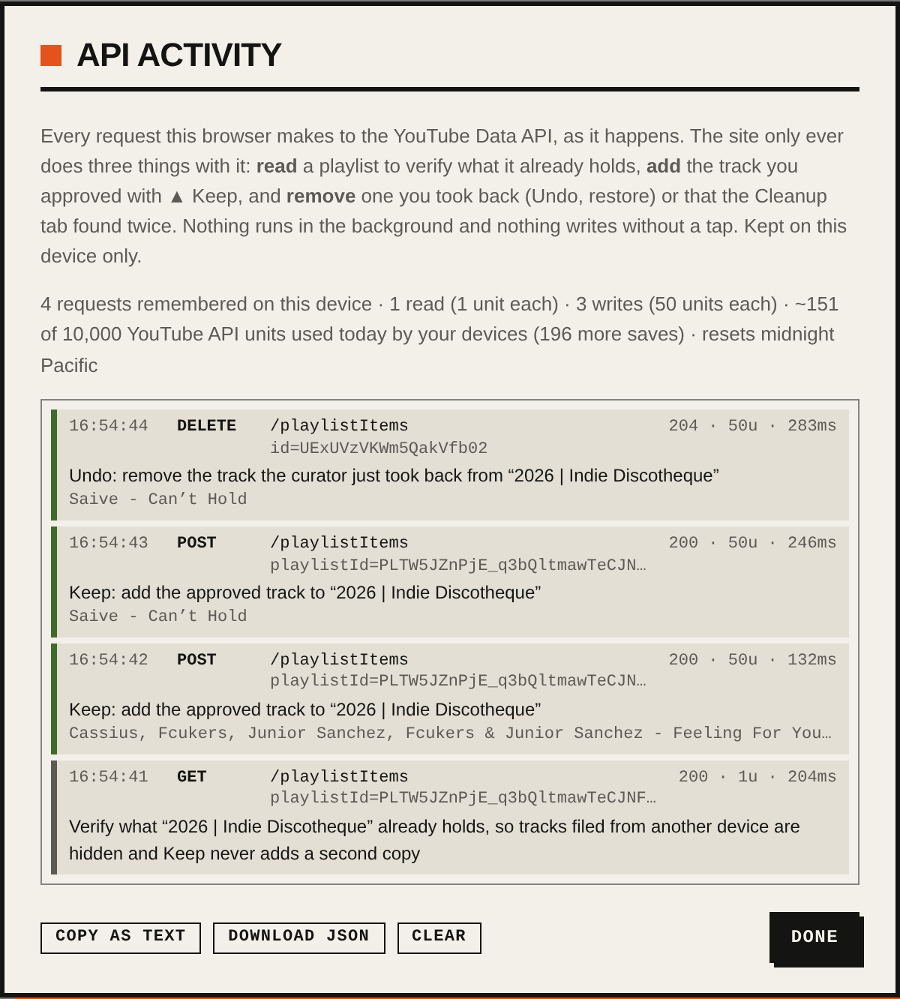

# YouTube API Services compliance review — screencast guide and reply

Google's quota-extension reviewers asked for *"a screencast or video recording showing how the API client verifies
playlist contents and automatically adds or removes user-approved music tracks within their personal, year-based
YouTube playlists."* This page is the shot list for that recording, the facts to narrate over it, and the reply to send
with it. Everything it describes is visible on the site itself: **⚙ → API activity** shows every YouTube Data API
request the browser makes, as it happens, with the reason for each one.

## What the API client does (the facts to narrate)

The client is the browser page at https://chrisrohn.com (`site/src`). There is no server: every YouTube Data API v3
request goes straight from the signed-in user's browser to `www.googleapis.com` with the OAuth token Google issued to
them. Only a few kinds of request exist, and each is bound to a tap:

| Step | Endpoint | Quota | When | Code |
|---|---|---|---|---|
| **Verify** what the playlist holds | `GET playlistItems` (`playlistId`, paged) | 1 unit / 50 tracks | On sign-in and every 30 min: this year's playlist (and the Skipped playlist) are read so tracks filed from another device are hidden and Keep never files a second copy | `refreshRecent` in `site/src/youtube.js` |
| **Verify** one video | `GET playlistItems` (`playlistId` + `videoId`) | 1 unit | Right before an add, when the reading above is stale or the target is another year's playlist; and before every Cleanup removal to find the exact items | `playlistItemsFor` in `site/src/youtube.js`, used by `site/src/rating.js` and `site/src/dupes.js` |
| **Add** the approved track | `POST playlistItems` | 50 units | Only when the user presses ▲︎ Keep on a card (or swipes right on a phone): the video is added to `<year> \| Indie Discotheque`, the year chosen on the card | `addToPlaylist` ← `rate()` in `site/src/rating.js` |
| **Remove** a track | `DELETE playlistItems` | 50 units | Undo within seconds of a Keep; *restore* on the Skipped tab; Cleanup: the extra copy of a song added twice, a copy the curator chose not to keep, a copy moved to another year, or a copy that will not play here (swapped for the upload that does) | `removePlaylistItem` ← `undo()`, `restoreAll()` in `rating.js`; `removeRow`, `moveRow`, `swapTrack` in `dupes.js` |
| **Look up** videos | `GET videos` (up to 50 ids) | 1 unit / 50 | Cleanup, on a tap: what each copy of a duplicated song is (length, channel, views, upload date, region), and the playability audit of a year playlist (a video left out of the answer is deleted or private, a `regionRestriction` away from the US is blocked) | `videoDetails` in `youtube.js`, used by `dupes.js` and `audit.js` |
| **Read** a playlist | `GET playlistItems` (`playlistId`, paged) | 1 unit / 50 | Cleanup, on a tap: the live scan of one year (duplicates as of now) and the playability audit of one year | `scanYear` in `dupes.js`, `auditYear` in `audit.js` |
| **Search** for a replacement | `GET search` (`type=video`, `videoCategoryId=10`, `regionCode=US`) | 100 units | Only when the curator presses *find a replacement now* on a track that cannot play here; the results are then checked with `GET videos` and offered, never added by themselves | `findReplacements` in `audit.js` |
| List the library | `GET playlists` (`mine=true`) | 1 unit / 50 | Guests: to find or create their own `<year> Picks from chrisrohn.com` playlist. Curators never create playlists; the year playlists are pinned by id | `loadLibraryPlaylists`, `playlistFor` in `youtube.js` |

Nothing runs in the background, nothing writes without a tap, and every write shows an Undo. Skips and wrong-video
flags are stored locally (no API call) unless the curator switches on filing skips into the unlisted Skipped
playlist. The daily GitHub Actions build reads the public year playlists by id with an API key only; it never writes.

Why the quota: a curator filing a year's worth of catalogue (the **Catalog** tab, 48 year playlists from 1979) and
cleaning duplicates and dead uploads (the **Cleanup** tab) spends 50 units per add or removal, so the default 10,000
units cap a day at about 200 playlist edits. The site already paces itself: it shows the running meter in ⚙, refuses
bulk actions the day's quota cannot cover, and reuses one playlist reading for every Keep in the following half hour.

## Recording the screencast

**Before you start**

1. Sign in on https://chrisrohn.com with the curator account. Open ⚙ → **API activity** → **Clear**, so the
   recording starts from an empty log, then **Done**.
2. In a second browser tab open the year playlist on YouTube Music (`https://music.youtube.com/playlist?list=<id>`,
   the current year's id from `discovery/config.yaml` → `youtube_music.playlists`). Scroll to the end: new adds append.
3. Optional: DevTools → Network, filter `googleapis.com/youtube`, so the raw requests are on screen too.
4. Record the whole screen (macOS: Shift-⌘-5; Windows: Win-Alt-R; Chrome: any screen recorder). Two to four minutes
   is plenty. Narrate, or add captions afterwards; the reviewer wants to *see* the requests match the story.

**Shot list**

| # | On screen | Say |
|---|---|---|
| 1 | The feed, signed in (the ▲︎ ▼︎ ≠ buttons on the cards). ⚙ open for a moment showing the Google account and the quota meter | "This is chrisrohn.com, a personal new-music feed. I'm signed in with my own Google account through Sign in with Google. The only thing the app does with the YouTube Data API is maintain my own year playlists." |
| 2 | ⚙ → **API activity**. It already shows the `GET playlistItems` rows from sign-in | "Each time I sign in, and every half hour, it reads this year's playlist, `2026 \| Indie Discotheque`, to verify what it already holds, so a track saved from my phone is hidden here and nothing is ever added twice. One quota unit per page." |
| 3 | Close the sheet. Play a card, then press **▲︎ Keep**. The card disappears, the toast says `▲︎ Artist – Title → 2026 \| Indie Discotheque` with **Undo** | "I approve a track. That is the one user action that writes: a `POST playlistItems` adding this video to the year playlist. The year comes from the card; I can change it before pressing Keep." |
| 4 | Switch to the YouTube Music tab, reload: the track is at the end of the playlist | "Here it is in the playlist on YouTube Music." |
| 5 | Back on the site, ⚙ → **API activity**: the new `POST` row reads *Keep: add the approved track to "2026 \| Indie Discotheque"* with the artist and title, `200 · 50u`; leave the sheet open | "The activity sheet shows the request, its result and its cost." |
| 6 | With the sheet still open, press Keep on another card whose year select is a different year (change it first). Two rows appear: `GET playlistItems videoId=…` *Keep: verify … does not already hold this video*, then the `POST` | "For another year's playlist it first verifies that the video is not already there, then adds it." |
| 7 | Press **Undo** on the toast. A `DELETE playlistItems` row appears: *Undo: remove the track the curator just took back* | "Undo removes exactly that playlist item." |
| 8 | Open the **Cleanup** tab. Show a duplicated song with its copies laid out; press **look up the copies** (`1 unit`): the rows fill in with length, channel and views. Press **keep one of ×2** on a copy held twice, confirm. Rows: `GET videos`, then `GET` *Cleanup: verify which playlist items hold this copy*, then `DELETE` *remove the extra copy…* | "The daily build lists every song the year playlists hold more than once — the same video twice, two uploads, two editions. Looking the copies up asks YouTube what each one is. Removing one first looks up the exact playlist items, then deletes only the extra copy." |
| 9 | If there is a *not streamable here* row: press **swap (100 units)**. Rows: `GET` verify, `POST` add the streamable upload, `DELETE` the dead copy | "A track that no longer streams in the US is swapped for the upload that does: verify, add, remove." |
| 9b | Under **Playability audit**, press **Audit this year** (`≈2 units per 50 tracks`). Rows: `GET playlistItems` pages *Audit: read …*, then `GET videos` *Audit: ask YouTube whether the tracks … can play in US*. Any finding appears under *not streamable here* with why | "The audit reads the playlist and checks every video with YouTube: a deleted, private or region-blocked track is listed, nothing is changed." |
| 10 | In the sheet press **Download JSON** (or **Copy as text**) | "Every request from this session, with its reason, is exported here; I'm attaching it to the reply." |

Attach the exported `youtube-api-activity-<date>.json` to the reply together with the video. The JSON has one row
per request: time, method, endpoint, parameters (playlist id, video id, item id), HTTP status, quota units, round trip,
and the reason in words. Nothing in it identifies anyone but the curator.

## The reply

Subject: *Re: YouTube API quota increase request — screencast attached*

> Hello,
>
> Thank you for the review. Attached (or linked below) is a screen recording of the API client, together with an
> export of every YouTube Data API request it made during the recording.
>
> **What the API client is.** chrisrohn.com is a personal new-music discovery site. It has no server; the API client
> is the web page itself, running in the browser of a signed-in user, calling the YouTube Data API v3 directly with
> the OAuth token Google issued to that user. It manages only that user's own playlists: for me, the curator, the
> `<year> | Indie Discotheque` playlists (one per year, 1979–2026) in my YouTube Music library.
>
> **How it verifies playlist contents.** On sign-in and every 30 minutes it reads the current year's playlist with
> `playlistItems.list` (1 unit per page) so that tracks already saved, including from another device, are hidden
> from the feed and never added twice. Before adding to any other playlist, and before every removal, it calls
> `playlistItems.list` with `playlistId` and `videoId` to confirm exactly which items hold that video.
>
> **How it adds tracks.** When I press Keep on a track (the one approving action, with an Undo), it calls
> `playlistItems.insert` (50 units) to add the video to the year playlist I chose on the card. Nothing is added
> automatically or in the background; every insert corresponds to a tap.
>
> **How it removes tracks.** `playlistItems.delete` (50 units) is called for Undo, for restoring a skipped track, and
> from the Cleanup tab, where I remove the extra copy of a song the daily build found twice in a playlist, or swap a
> track that no longer streams in my region for the upload that does (one insert, one delete).
>
> **Why more quota.** The default 10,000 units per day allow about 200 playlist edits. Filling the earlier years
> from my listening history and cleaning 48 year playlists of duplicates and dead uploads regularly needs more than
> that in a sitting. The client already paces itself (a visible quota meter, bulk actions limited to what the day's
> quota covers, one playlist reading reused for every add in the following half hour). Requested: 50,000 units/day.
>
> The recording also shows the client's own API activity view (⚙ → API activity), which lists each request, its
> endpoint, result and quota cost as it happens. The complete source is public at https://github.com/chrisrohn/chrisrohn
> (the API client is in `site/src/youtube.js`, `rating.js` and `dupes.js`); the privacy policy and terms are at
> https://chrisrohn.com/privacy.html and https://chrisrohn.com/terms.html.
>
> Please keep this address as the API contact.
>
> Thank you,
> Chris Rohn

Fill in the quota figure you actually asked for in the Cloud console form (the paragraph above says 50,000) and add
the link to the video if it is not attached.
